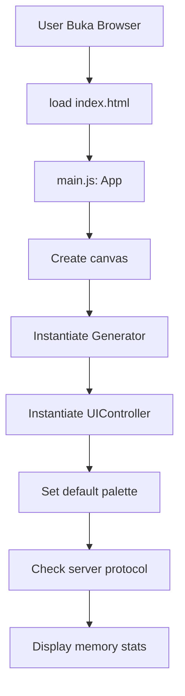

## 📄 `README.md` - Complete Documentation

```markdown
# 🍄 Psychedelic Background Generator

> WebGL-based psychedelic pattern generator with multi-threaded video export support


---

## 📋 Daftar Isi

- [Fitur Utama](#-fitur-utama)
- [Flow Kerja Aplikasi](#-flow-kerja-aplikasi)
- [Teknologi](#-teknologi)
- [Struktur Proyek](#-struktur-proyek)
- [Instalasi & Menjalankan](#-instalasi--menjalankan)
- [Cara Penggunaan](#-cara-penggunaan)
- [Mode Animasi](#-mode-animasi)
- [Export & Rendering](#-export--rendering)
- [Batch Processing](#-batch-processing)
- [Keyboard Shortcuts](#-keyboard-shortcuts)
- [Troubleshooting](#-troubleshooting)
- [License](#-license)

---

## ✨ Fitur Utama

### 🎨 **Real-time Rendering**
- Animasi psychedelic berbasis WebGL dengan fragment shader
- 3 mode animasi: Psychedelic, Organic Blob, Kaleidoscope
- Parameter real-time: Distorsi, Kompleksitas, Kecepatan, Skala
- Palette system dengan 6 preset + custom HEX input

### 📹 **Video Frame Export (Streaming)**
- Export frame-by-frame langsung ke folder (tanpa zip/ram)
- Multi-threaded rendering dengan Web Workers
- Support resolusi hingga 8K
- Auto-adjust worker count berdasarkan resolusi
- Frame retry mechanism (max 3 retries)

### 📦 **Batch Processing**
- Load/Export multiple settings dari JSON
- Auto-generate subfolder per setting
- Progress tracking per batch item

### 💾 **Single Export**
- Export current frame ke PNG / JPEG / WebP
- Menggunakan `canvas.toBlob()` untuk performa optimal

### 🎮 **User Experience**
- Pause/Play animasi (Spacebar shortcut)
- Dynamic UI parameter per mode
- Progress overlay dengan speed tracking
- Summary card setelah export selesai
- Toast notifications

---

## 🔄 Flow Kerja Aplikasi

### 1. Inisialisasi Aplikasi

## 🔄 Flowchart Aplikasi

## 🔄 Flowchart Aplikasi



### 2. Render Loop (Real-time)

```
requestAnimationFrame Loop
       │
       ▼
Generator.renderFrame()
├── Check: isPaused? → Skip
├── Get elapsed time
├── Update uniforms (time, duration, aspect)
├── Mode-specific uniforms via mode.updateUniforms()
└── gl.drawArrays(TRIANGLE_STRIP, 0, 4)
       │
       ▼
Fragment Shader (GPU)
├── Hitung UV coordinates
├── Mode selection (if-else based on u_mode)
│   ├── renderPsychedelic (FBM Noise + Distortion)
│   ├── renderBlob (Blob Amoeba)
│   └── renderKaleidoscope (Symmetry + FBM Noise)
├── Palette mapping (interpolasi antar palette colors)
├── Vignette effect
└── Output: gl_FragColor
```

### 3. Export Flow

```
User klik Export
       │
       ▼
ExportUI.startExport()
├── Check server (file:// → error)
├── Calculate total frames = fps × duration
├── Confirm if > 1000 frames
├── window.showDirectoryPicker() → select folder
└── Show progress overlay
       │
       ▼
Exporter.startExport()
├── Get optimal worker count (based on resolution)
│   ├── >4K → 2 workers
│   ├── >1080p → 3 workers
│   └── ≤1080p → 4 workers
├── Create queue: [0, 1, 2, ..., totalFrames-1]
├── Spawn workers (render.worker.js)
└── Dispatch frames ke worker
       │
       ▼
Worker Process (per frame)
├── renderFrame(params)
│   ├── Init WebGL (OffscreenCanvas)
│   ├── Render frame
│   └── canvas.convertToBlob() → PNG blob
└── PostMessage { frameIndex, blob, success }
       │
       ▼
Save Frame (Main Thread)
├── dirHandle.getFileHandle(`frame_XXXX.png`)
├── writable.write(blob)
├── writable.close()
├── completed++
├── Update progress UI
└── If completed == totalFrames → finish()
       │
       ▼
Export Complete
├── Terminate workers
├── Show Summary Card
└── Reset UI
```

### 4. Batch Export Flow

```
User klik Export (dengan batch settings)
       │
       ▼
BatchUI.startBatchExport()
├── Check batchSettings loaded
├── window.showDirectoryPicker() → select root folder
├── For each setting:
│   ├── applySettingsObject(setting)
│   ├── Create subfolder: export_01, export_02, ...
│   ├── Update UI progress
│   └── generator.startExport({ dirHandle: subfolder })
└── Show toast: "✅ Batch complete! X folders"
```

---

## 🏗️ Teknologi

| Teknologi | Keterangan |
|-----------|------------|
| **WebGL 2.0** | GPU-accelerated rendering dengan fragment shader |
| **Web Workers** | Multi-threaded rendering untuk export |
| **File System Access API** | Streaming frame langsung ke disk |
| **OffscreenCanvas** | Render di background thread |
| **ES Modules** | Struktur kode modular |
| **CSS3** | UI dengan dark theme & animations |

---

## 📁 Struktur Proyek

```
project/
├── index.html                 # Main HTML
├── style.css                  # UI Styling
├── render.worker.js           # Web Worker untuk rendering
├── README.md                  # Dokumentasi
└── src/
    ├── main.js                # Entry point
    ├── core/
    │   ├── Generator.js       # Main application class
    │   ├── Renderer.js        # WebGL rendering
    │   ├── Exporter.js        # Export logic (workers)
    │   └── ShaderBuilder.js   # Dynamic shader builder
    ├── modes/
    │   ├── BaseMode.js        # Base class for modes
    │   ├── PsychedelicMode.js # Psychedelic pattern
    │   ├── BlobMode.js        # Organic blob
    │   └── KaleidoscopeMode.js # Kaleidoscope
    ├── ui/
    │   ├── UIController.js    # Main UI controller
    │   ├── PaletteUI.js       # Palette management
    │   ├── ExportUI.js        # Export UI (progress, summary)
    │   └── BatchUI.js         # Batch/JSON management
    └── utils/
        ├── constants.js       # Constants (palettes)
        └── helpers.js         # Utility functions
```

---

## 🚀 Instalasi & Menjalankan

### Prerequisites
- Browser dengan WebGL 2.0 support (Chrome, Firefox, Edge)
- Local HTTP server (untuk export feature)

### Menjalankan dengan Python

```bash
# Python 3
python -m http.server 8000

# Python 2
python -m SimpleHTTPServer 8000
```

### Menjalankan dengan Node.js

```bash
npx serve .
```

### Buka di Browser

```
http://localhost:8000
```

> ⚠️ **Warning:** Export feature membutuhkan HTTP server! Tidak bisa dijalankan dari `file://` protocol.

---

## 🎮 Cara Penggunaan

### 1. Kontrol Utama

| Control | Fungsi |
|---------|--------|
| **Distortion** | Mengontrol distorsi pola (0.2 - 3.0) |
| **Complexity** | Mengontrol detail fractal (1 - 8) |
| **Speed** | Kecepatan animasi (0.05 - 2.0) |
| **Scale** | Skala pola (0.5 - 5.0) |
| **Aspect Ratio** | Rasio aspek canvas (1:1, 16:9, 9:16, 4:3, 21:9) |
| **Resolution** | Resolusi export (720p, 1080p, 4K, 8K) |

### 2. Mode Animasi

| Mode | Deskripsi |
|------|-----------|
| **🌀 Psychedelic** | Classic fractal noise dengan distorsi organik |
| **🫧 Organic Blob** | Blob/amoeba dengan parameter: count, size, speed, wobble |
| **🔮 Kaleidoscope** | Symmetry pattern dengan parameter: segments, rotation, zoom, detail |

### 3. Palette

| Palette | Deskripsi |
|---------|-----------|
| **Rainbow** | Full spectrum gradient |
| **Neon** | Cyan-magenta neon glow |
| **Sunset** | Warm orange-red gradient |
| **Ocean** | Cool blue-teal gradient |
| **Cosmic** | Deep purple-blue space theme |
| **Acid** | Bright green-yellow acid theme |
| **Custom** | Input HEX colors (#ff0000, #00ff00, #0000ff) |

---

## 📹 Export & Rendering

### Single Export

| Format | Keterangan |
|--------|------------|
| **PNG** | Lossless, transparansi (default) |
| **JPEG** | Compressed, ukuran kecil |
| **WebP** | Modern format, kualitas baik |

### Video Frame Export (Streaming)

**Parameter:**
- **FPS:** 1 - 60 frames per second
- **Duration:** 1 - 30 seconds
- **Total Frames:** FPS × Duration

**Proses:**
1. Pilih folder tujuan via `showDirectoryPicker()`
2. Aplikasi akan render setiap frame menggunakan Web Workers
3. Frame disimpan sebagai `frame_0001.png` sampai `frame_NNNN.png`
4. Progress ditampilkan di overlay

**Konversi ke Video (FFmpeg):**

```bash
ffmpeg -framerate 30 -i frame_%04d.png -c:v libx264 -pix_fmt yuv420p -preset ultrafast -crf 18 output_30fps.mp4
```

> 💡 Command otomatis ter-update berdasarkan FPS yang dipilih

### Performance Optimization

| Resolusi | Worker Count | Notes |
|----------|--------------|-------|
| ≤1080p | 4 workers | Max performance |
| 1440p - 2160p (4K) | 3 workers | Balanced |
| >4K (8K) | 2 workers | Memory safe |

---

## 📦 Batch Processing

### Download Settings JSON

Klik **💾 Download Current** untuk menyimpan semua parameter ke JSON:

```json
{
  "distortion": 1.5,
  "complexity": 3,
  "speed": 0.5,
  "scale": 2.0,
  "aspectRatio": "16:9",
  "resolution": "2160",
  "fps": 30,
  "duration": 5,
  "mode": "psychedelic",
  "modeParams": { "distortion": 1.5, ... },
  "paletteName": "rainbow",
  "palette": [[1,0,0], ...],
  "sessionName": "my_export"
}
```

### Load Batch JSON

1. Klik **📂 Load Batch JSON**
2. Pilih file JSON (single object atau array)
3. Jika array, semua setting akan di-load sebagai batch

### Batch Export

1. Load JSON dengan multiple settings
2. Klik **Export** → akan muncul **Export Xx from JSON**
3. Pilih root folder
4. Setiap setting akan di-export ke subfolder: `export_01`, `export_02`, ...

### Contoh Batch JSON

```json
[
  {
    "mode": "psychedelic",
    "distortion": 1.5,
    "paletteName": "rainbow"
  },
  {
    "mode": "blob",
    "blobCount": 7,
    "blobSize": 0.2,
    "paletteName": "ocean"
  },
  {
    "mode": "kaleidoscope",
    "segments": 8,
    "paletteName": "cosmic"
  }
]
```

---

## ⌨️ Keyboard Shortcuts

| Shortcut | Fungsi |
|----------|--------|
| **Space** | Toggle Pause/Play (hanya saat focus di body) |
| **Enter** | Apply custom palette (saat focus di input custom) |

---

## 🐛 Troubleshooting

### 1. Export tidak bekerja
**Penyebab:** Menjalankan dari `file://` protocol
**Solusi:** Gunakan HTTP server:
```bash
python -m http.server 8000
```

### 2. WebGL error / Canvas hitam
**Penyebab:** Browser tidak support WebGL atau driver issue
**Solusi:**
- Update browser
- Check WebGL support: `chrome://gpu` (Chrome)
- Aktifkan hardware acceleration

### 3. 8K export memory error
**Penyebab:** 8K terlalu berat untuk browser
**Solusi:**
- Gunakan resolusi 4K atau 1080p
- Reduce duration / total frames
- Tutup aplikasi lain yang consume memory

### 4. Worker tidak merespon
**Penyebab:** `render.worker.js` tidak ditemukan
**Solusi:** Pastikan `render.worker.js` ada di root directory

### 5. JSON load gagal
**Penyebab:** Format JSON tidak valid
**Solusi:** Validasi JSON menggunakan validator online

---

## 📝 License

MIT License

Copyright (c) 2026

Permission is hereby granted, free of charge, to any person obtaining a copy
of this software and associated documentation files (the "Software"), to deal
in the Software without restriction, including without limitation the rights
to use, copy, modify, merge, publish, distribute, sublicense, and/or sell
copies of the Software, and to permit persons to whom the Software is
furnished to do so, subject to the following conditions:

The above copyright notice and this permission notice shall be included in all
copies or substantial portions of the Software.

---

## 🙏 Credits

Dibangun dengan ❤️ menggunakan:
- WebGL 2.0
- Web Workers
- File System Access API
- OffscreenCanvas

---

## 📞 Kontak

Untuk pertanyaan atau saran, silakan buat issue di repository.

---

**🔥 Happy Generating!** 🍄
```
